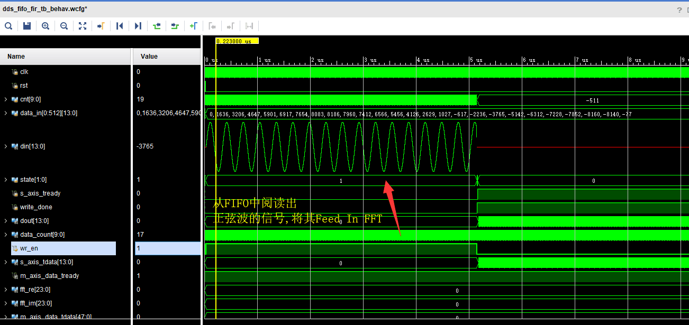
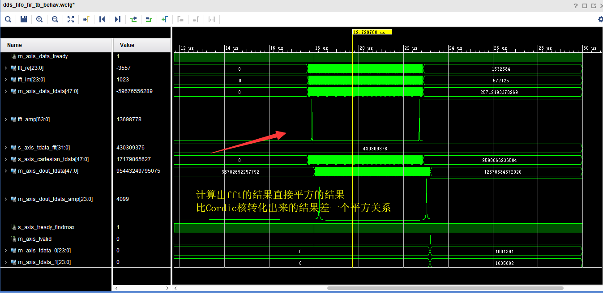
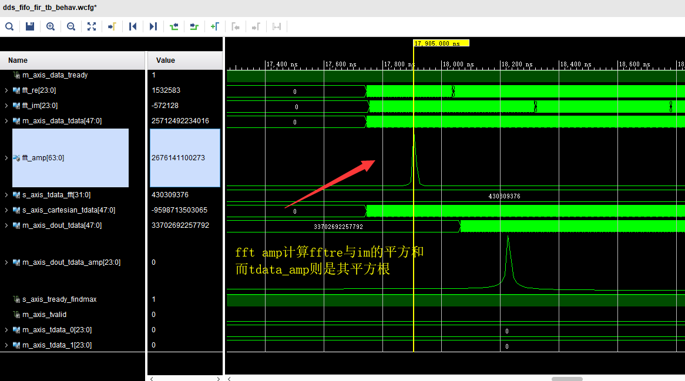
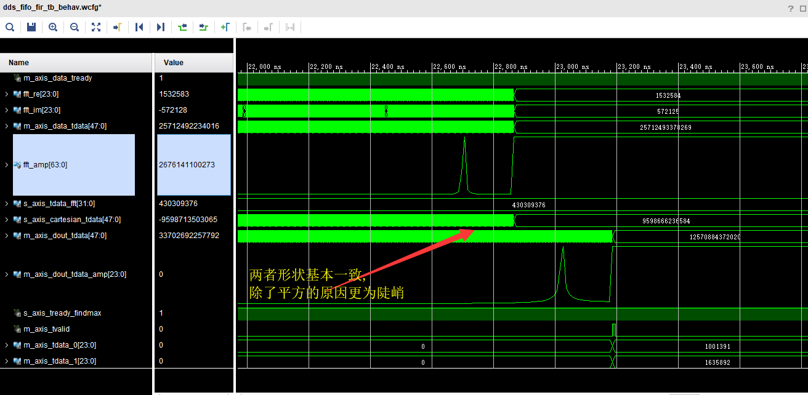
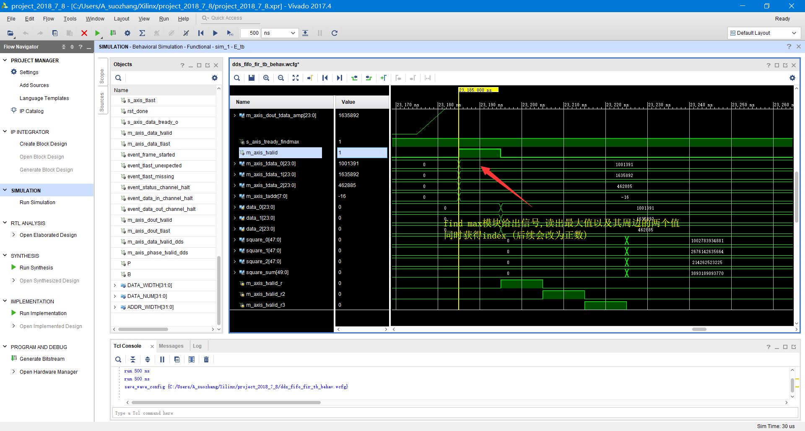
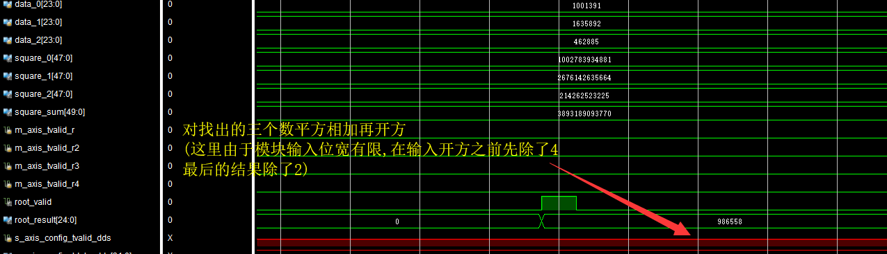
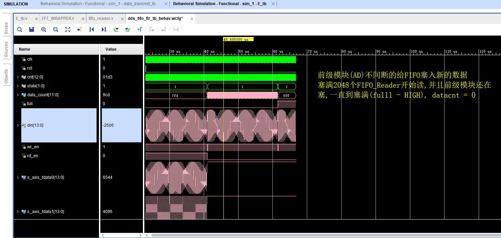
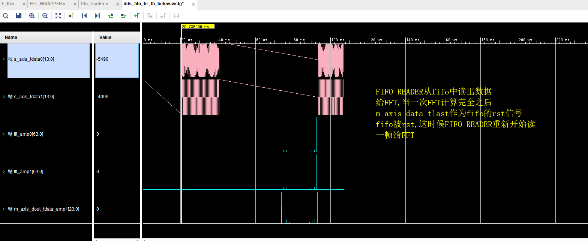
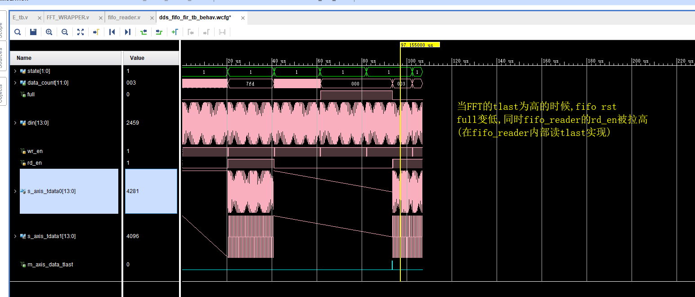

# 2017E

## Intro
* The Implemention Code For The NEUDC 2017 E - Adaptive Filter
    * WITHOUT Analog Part
    * WITHOUT The Digital Phase Shift
    * Using FFT To Solve 
    * **Fail** To Meet The Amplitude Demand
* PLATFORM : Zynq + ADDA

## Structure
* impl_run_bak/: Contains A Few .BIT
* simu/ : simulation wave
* src/ contains all codes

## Procedure
* 首先从FIFO(来自于AD采样),获得数据(14bit)
* 将数据进入FFT,获得24bit Re & Im (实际达不到24bit)
    * 有调试信号fft_amp = fft_re^2 + fft_im^2: 
    * **Example**: fft_re: 1532583   fft_im: -572128   fft_amp: 2676141100273   
        * Cordic Result: 1635892
* 经过Cordic的Transition,获得Amp(FFT的模) - 24bit
* 进入一个Find Max模块,找到Amp的最大值以及其周围的两个值(都是24bit) 以及最大值的索引位置
    * **Example**: 1001391  -  1635892   - 462885
* 对这三个值都做平方处理(48比特)求和(50比特)
    * 粗略地找出信号的功率以确定其幅度
* 对以上的结果做开根号
    * 由于Cordic核最多支持48位的输入,所以需要将以上结果右移2位(相当于除4)
    * 最后的结果相当于除2: 
        * **Example** 986558

## Simulation Timing Diagram
* 1st Ver
    * 
    * 
    * 
    * 
    * 
    * 
* 2nd Ver
    * 
    * 
    * 

## Calibration
* freq = 10kHz     
    * NFFT = 512
    * Max_addr = 16(16th)   
    * fs = 312500
    * f0 = 16/512*312500 = 9765.625
        * 相对误差 2 % 

* 312500 fs 在高f的时候效果相对差,频率偏移较大

|Amp    |  Result|
|--|--|
|1| 986558|
|0.5|493273|
|0.25|246645|
|0.77 |759645|

* 62500 fs

|Amp| Result|
|--|--|
|1|1021336|
|0.77|786447|

* Amp = 1

|Freq| Result|
|--|--|
|12000|12207|
|11000|10986|
|52000|52490|
|89111|89000|
|70000|69580|
|100000|100097|

* Amp = 1

|Freq|Unit_Amp|
|--|--|
|10000|1021366|
|20000|986588|
|30000|973970|
|40000|1016273|
|50000|1047896|
|60000|1032413|
|70000|990959|
|80000|971348|
|90000|1006368|
|100000|1044361|
|Mean|1009154|

* (现在比之前在fft进入的时候多了一次移位,所以大小除2)
|0.5|455678|12K|
|0.5|470650|20K|
|0.5|523590|50K|
|0.5|500794|90k|
|0.3|258366|12K|
|0.1|68296|12K|

